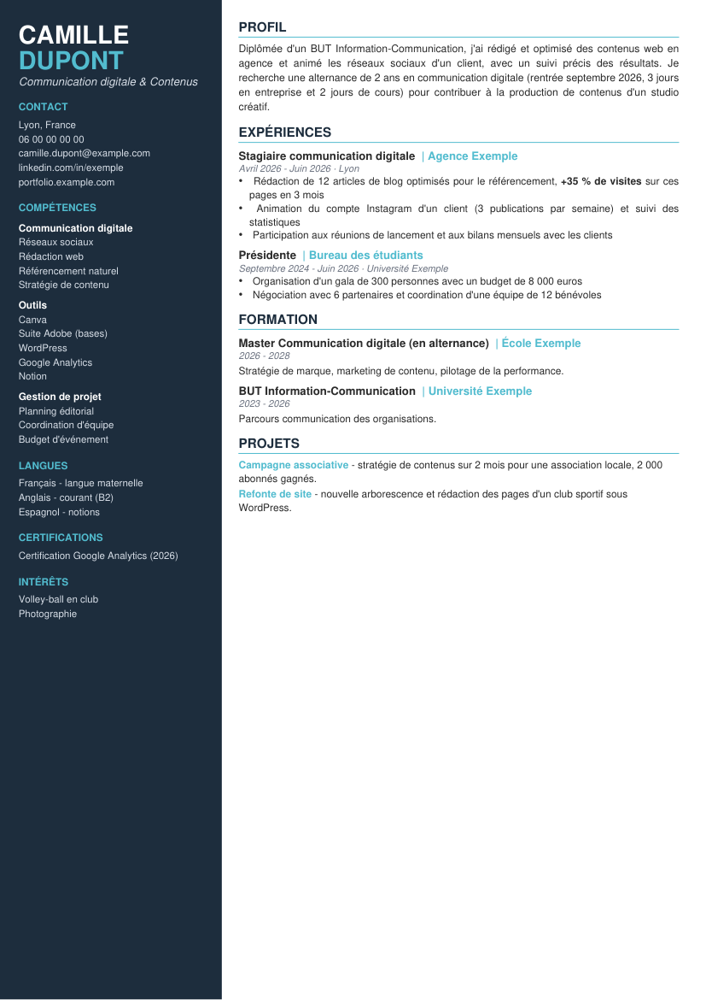
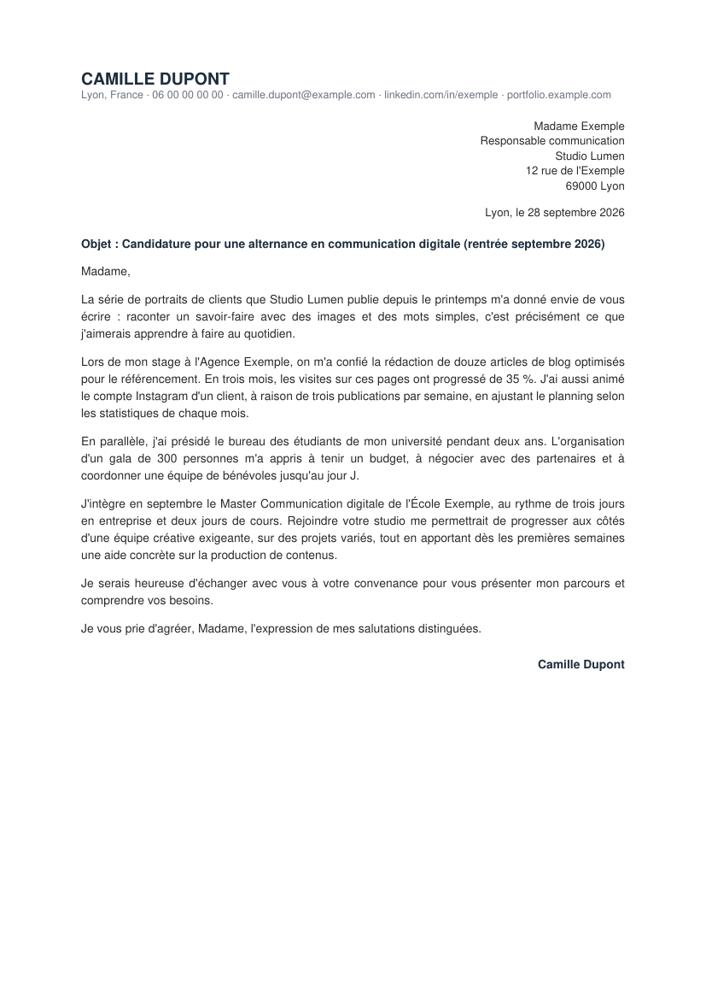
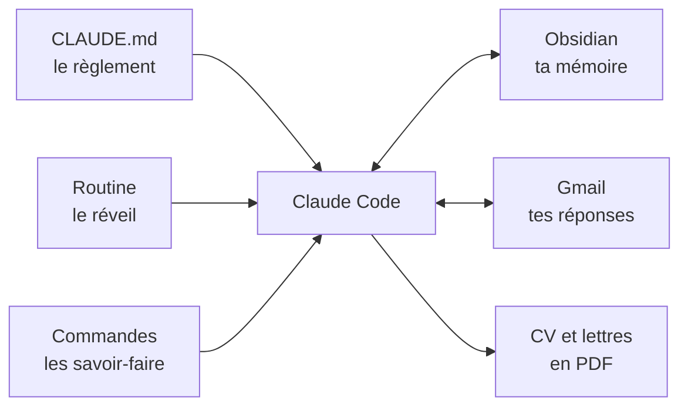

# Copilote alternance

**Ta recherche d'alternance, organisée et suivie par Claude. Toi, tu restes le pilote.**

Chercher une alternance, c'est des dizaines de candidatures, autant de relances, des réponses éparpillées entre ta boîte mail, Indeed et LinkedIn, et la peur de rater LE mail important. Le copilote s'occupe de toute la partie ingrate : il relève tes réponses, tient ton suivi à jour, prépare tes candidatures et te rappelle qui relancer. Toi, tu choisis, tu relis et tu envoies.

Il repose sur trois outils : **Claude Code** (l'assistant qui travaille sur tes fichiers), **Obsidian** (ton tableau de bord, gratuit) et **Gmail** (pour relever les réponses). Et il est né d'une vraie recherche d'alternance, menée jusqu'à la signature d'un contrat.

## Ce que ça change pour toi

- 📬 **Chaque matin, le point est fait.** En ouvrant Claude, tes réponses sont relevées (mails et plateformes), tes fiches mises à jour, et tu sais exactement quoi faire.
- 🎯 **Une offre, un verdict en 30 secondes.** Tu colles une annonce : Claude la compare à tes critères (zone, métier, rythme, date) et te dit si elle vaut le coup, et pourquoi elle est faite pour toi.
- ✍️ **Des candidatures sur mesure, sans rien inventer.** CV adapté et lettre en PDF, écrits à partir de ton vrai parcours, avec ta façon d'écrire.
- 🔁 **Plus aucune relance oubliée.** J+7 par mail, J+14 par téléphone : messages et scripts d'appel prêts.
- 🗣️ **Une antisèche pour chaque entretien.** Qui est en face, tes points forts face à leurs besoins, tes réponses prêtes, tes questions.
- ✅ **Le jour du oui, rien n'est oublié.** Checklist complète : entreprise, école, CFA, contrat, papiers.
- 🧰 **Rien à installer toi-même.** Tu tapes `/demarrer` : Claude installe Obsidian, crée ton espace de suivi, retrouve ton CV et tes papiers sur ton ordinateur, reprend les candidatures déjà envoyées depuis ta boîte mail, et te pose quelques questions sur ta situation.

## Ce qu'il ne fait jamais

- Il **n'envoie rien** sans ton accord explicite : il prépare des brouillons, c'est toi qui cliques sur Envoyer.
- Il **n'invente rien** : chaque phrase de tes candidatures vient de ton parcours réel.
- Il **ne se connecte pas à ta place** et ne touche jamais à un mot de passe.
- Il **ne fouille ton ordinateur qu'avec ton accord**, ne déplace et ne supprime rien, et ne lit jamais le contenu de tes papiers sensibles.

## Démarrer en 3 étapes

1. **Installe l'application Claude** pour ordinateur ([claude.ai/download](https://claude.ai/download)). Un abonnement Claude Pro ou Max est nécessaire.
2. **Récupère ce dossier** : bouton vert **Code**, puis **Download ZIP**, et décompresse-le où tu veux.
3. **Ouvre le dossier dans l'onglet Code de l'application Claude et tape `/demarrer`.** Claude s'occupe du reste et te guide.

Tu préfères le terminal ? Tout est dans le [guide d'installation](docs/installation.md), y compris l'installation en une commande.

## Les commandes

| Commande | Ce qu'elle fait |
|---|---|
| `/demarrer` | Installe et personnalise tout : outils, Obsidian, documents, profil, CV, candidatures déjà envoyées |
| `/releve` | Relève tes réponses, met à jour ton suivi et te dit quoi faire (lancée toute seule à l'ouverture) |
| `/nouvelle-piste` | Donne son verdict sur une offre et crée sa fiche |
| `/candidature` | Prépare le CV adapté et la lettre ou le message, en brouillon |
| `/relances` | Liste les relances dues et prépare les mails et les appels |
| `/entretien` | Prépare l'antisèche d'un entretien, puis le remerciement |
| `/employeur-oui` | Déroule la checklist du jour où une entreprise dit oui |
| `/bilan` | Fait le point chiffré : ce qui marche, ce qu'il faut ajuster |

Pas besoin de retenir les commandes : parle normalement (« j'ai reçu une réponse de Studio Lumen », « prépare-moi pour mon entretien de jeudi ») et Claude choisit la bonne.

## À quoi ça ressemble

| Un CV adapté à l'offre | La lettre qui va avec |
|---|---|
|  |  |

*Personnage et entreprises fictifs.* Exemples de fiches de suivi : [une piste en entretien](<exemples/Pistes/Studio Lumen - Chargé de communication digitale (Lyon).md>), [une piste à relancer](<exemples/Pistes/Maison Horizon - Assistant marketing (Villeurbanne).md>).

Dans Obsidian, le tableau de bord rassemble tes critères, le tableau de toutes tes pistes (avec les relances en retard signalées), l'annuaire des relances téléphoniques et le journal de ta recherche.

## Comment c'est construit



Aucun serveur, aucun abonnement en plus : des fichiers texte que Claude lit et met à jour sur ton ordinateur. Détails dans [comment ça marche](docs/comment-ca-marche.md).

## Tes données restent chez toi

Ton profil, tes pistes, ton CV et tes lettres vivent dans des fichiers privés que git ne publie jamais. Un garde-fou peut même bloquer toute publication contenant ton nom, ton téléphone ou ton mail si tu partages ta propre version. Tout est expliqué dans [tes données](docs/confidentialite.md).

## Leçons du terrain (extrait)

1. **Un compte créé n'est pas une candidature envoyée** : seule compte la preuve (mail « candidature reçue » ou écran de confirmation).
2. **J+7 par mail, J+14 par téléphone** : l'appel débloque ce qu'un mail de plus ne débloque pas.
3. **Le rythme d'alternance est LA question qui décide** : aie la réponse officielle de ton école avant tes entretiens, et convaincs l'entreprise plutôt que l'école.
4. **Une adresse nominative bat une boîte générique** : cherche la bonne personne.
5. **Le jour du oui, tout se joue en 24 à 48 heures** : prépare tes papiers dès le début.

Les 19 leçons : [Leçons du terrain](<modele-suivi/Leçons du terrain.md>).

## Adapter à ton cas

- **Stage, premier emploi, autre année d'études** : le fonctionnement est le même, change simplement tes critères dans le tableau de bord.
- **Beaucoup d'offres à évaluer d'un coup** : le copilote peut se brancher sur [career-ops](integrations/career-ops/README.md).
- **Ton propre style** : tout est modifiable en texte simple (règles dans `CLAUDE.md`, commandes dans `.claude/skills/`, modèles dans `modele-suivi/`).

## Ce que contient le dossier

```
copilote-alternance/
├── CLAUDE.md                  le règlement que Claude suit
├── .claude/
│   ├── settings.json          la routine de démarrage
│   ├── hooks/                 le script de la routine
│   └── skills/                les 8 commandes
├── modele-suivi/              le modèle Obsidian (tableau de bord, fiches, checklist, messages)
├── profil/                    ton profil (l'exemple est fictif, le tien reste privé)
├── documents/                 fabrication du CV et des lettres en PDF
├── scripts/                   installation, diagnostic, liaison Obsidian, recherche de documents, garde-fou
├── exemples/                  fiches d'exemple (fictives)
├── integrations/career-ops/   branchement facultatif sur career-ops
└── docs/                      installation, fonctionnement, données
```

## Licence

MIT : utilise-le, modifie-le, partage-le librement.
