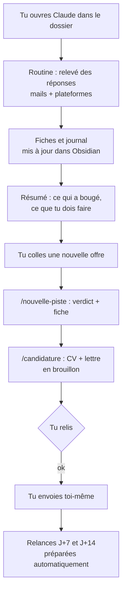

# Comment ça marche

Le copilote tient en quatre pièces simples. Aucune n'est un logiciel à part : ce sont des fichiers que Claude Code lit et applique.

## 1. Le règlement : `CLAUDE.md`

Claude le lit au début de chaque conversation. Il y trouve son rôle (copilote, pas pilote), les règles d'or (rien ne part sans ton accord, rien n'est inventé, chaque événement est noté), le calendrier des relances et l'emplacement de chaque chose.

## 2. Le réveil : la routine de démarrage

Un petit script (`.claude/hooks/routine-releve.sh`) se lance à chaque ouverture de Claude dans le dossier. Il rappelle à Claude de faire le relevé des réponses, sauf s'il a déjà été fait aujourd'hui ou si tu as coupé la routine dans ton profil.

## 3. Les savoir-faire : les commandes

Chaque commande (`/releve`, `/nouvelle-piste`, `/candidature`...) est une fiche méthode rangée dans `.claude/skills/`. Claude les suit quand tu tapes la commande, ou de lui-même quand ta demande y correspond (« j'ai reçu une réponse de X » déclenche le relevé).

## 4. La mémoire : ton dossier de suivi Obsidian

Un tableau de bord, une fiche par entreprise, une checklist, des modèles de messages. Tout est en texte simple : lisible dans Obsidian, modifiable par toi comme par Claude, et à toi pour toujours (pas d'abonnement, pas de serveur).

## Une journée type

## Où vont tes informations

| Information | Rangée dans | Publiée sur GitHub ? |
|---|---|---|
| Ton profil (identité, parcours, style) | `profil/profil.md` | jamais |
| Tes pistes, ton journal | ton dossier de suivi | jamais |
| Les données de ton CV | `documents/cv.yml` | jamais |
| Tes lettres et tes PDF | `documents/lettres/`, `documents/sortie/` | jamais |
| Les règles, les commandes, les modèles vides | le reste du dossier | oui (c'est le projet) |

Voir aussi [confidentialite.md](confidentialite.md).
